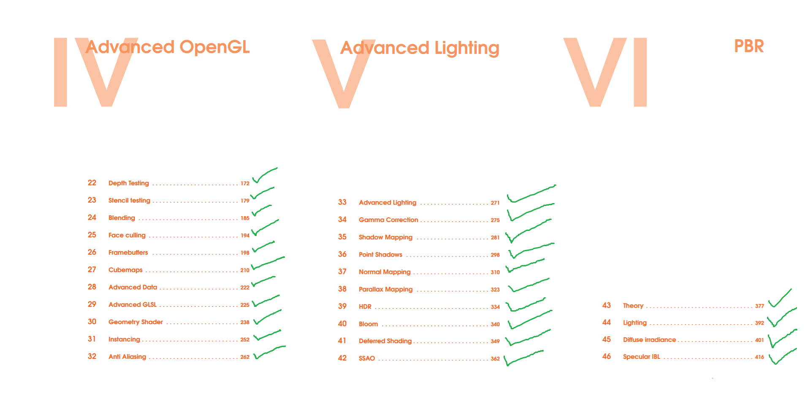
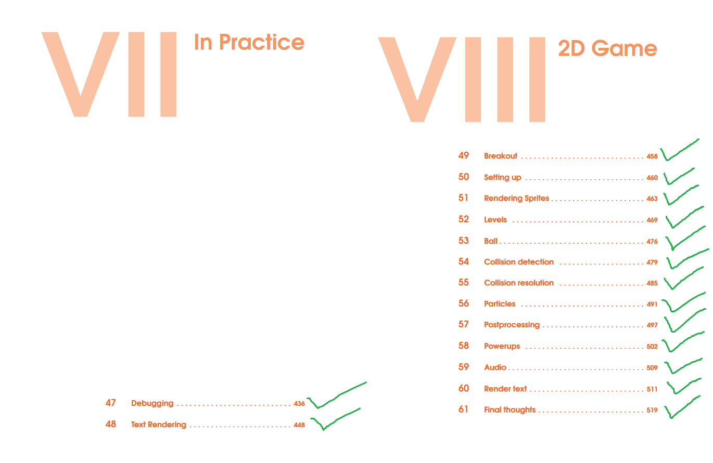
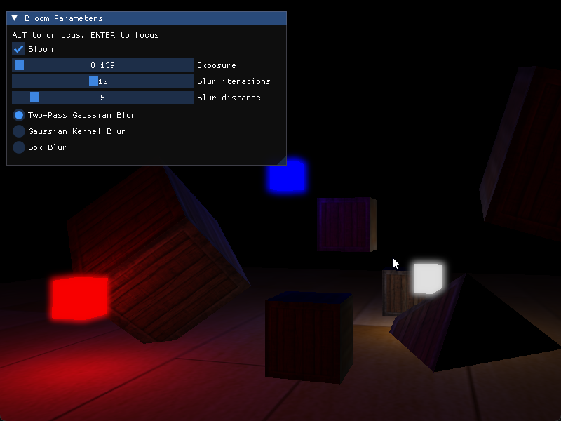

# LearnOpenGL Solutions

The code for the breakout game (with some additional features) can be found [here](https://github.com/cmd05/breakout-game).

Some interesting output (sound warning):

https://github.com/cmd05/learn-opengl-solutions/assets/63466463/49c95e62-c074-46f9-9712-7f504a4ffc21

  

https://github.com/user-attachments/assets/3279802e-f52c-4323-be21-8e9faee7d031